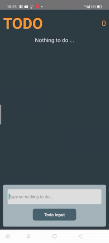
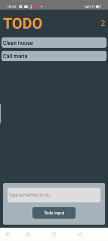

<h1 align="center">{TodoApp}</h1>


## Table of Contents

- [Overview](#overview)
- [Built With](#built-with)
- [How to use](#how-to-use)
- [Acknowledgements](#acknowledgements)
- [Contact](#contact)

<!-- OVERVIEW -->

## Overview




Introduce your projects by taking a screenshot or a gif. 

### Built With


- HTML
- CSS
- [React](https://reactjs.org/)
- [React-Native](https://reactnative.dev/)


## How To Use


To clone and run this application, you'll need [Git](https://git-scm.com) and [Node.js](https://nodejs.org/en/download/) (which comes with [npm](http://npmjs.com)) installed on your computer. From your command line:

```bash

$ git clone https://github.com/efemevlut/React-Native-TodoApp2.git


$ npm install

$ npx react-native run-android
```

## Acknowledgements


- [Node.js](https://nodejs.org/)

## Contact

- GitHub [@your-efemevlut](https://{github.com/efemevlut})
- Linkedin [@your-linkedin](https://www.linkedin.com/in/mevl%C3%BCt-efe-5465221b8/)

